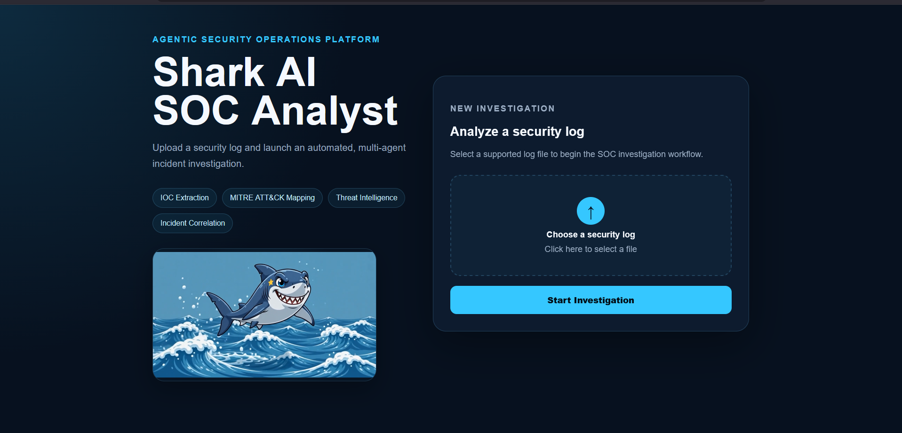
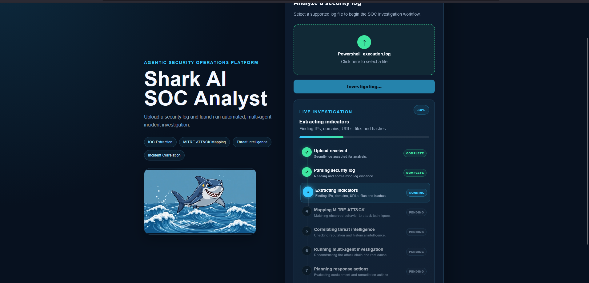
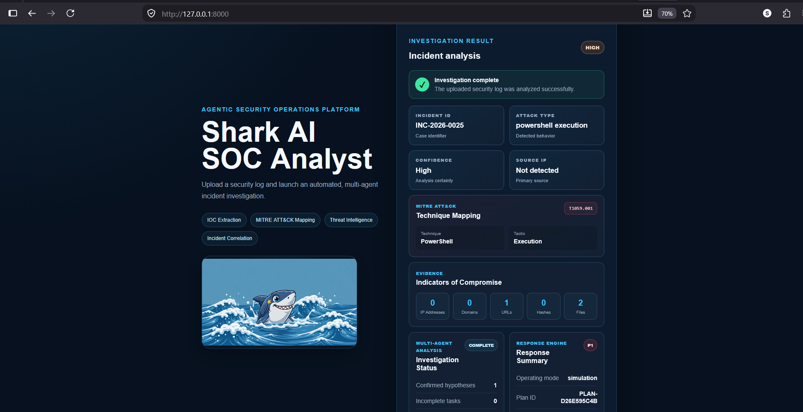
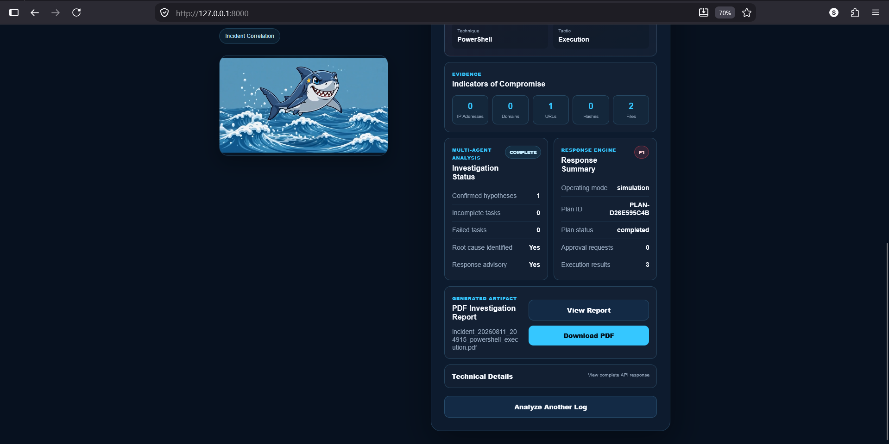

# 🦈 Agentic AI SOC Analyst

An AI-assisted Security Operations Center (SOC) investigation platform built with **Python, FastAPI, Ollama, and MITRE ATT&CK**.

The project analyzes security logs, extracts Indicators of Compromise (IOCs), identifies potential attack techniques, correlates related security events, enriches indicators using threat intelligence, and generates structured investigation and response recommendations.

> **Project Status:** 🚧 Active Development

---

## 🎯 Project Objective

Modern SOC analysts deal with large volumes of alerts, logs, threat intelligence, and investigation data.

The goal of **Agentic AI SOC Analyst** is to explore how AI can assist analysts during the investigation process by combining:

- Security log analysis
- IOC extraction
- MITRE ATT&CK mapping
- Threat intelligence
- Incident correlation
- AI-assisted investigation
- Response recommendations
- Structured incident reporting

The system is designed as an **analyst-assistance platform**, rather than a replacement for human security analysts.

---

## ✨ Features

### 🔍 Security Log Analysis

Analyzes security events and generates structured information such as:

- Severity
- Attack type
- Source IP
- Confidence score
- Indicators of Compromise
- Recommended investigation actions

Example security events include:

- SSH brute-force attempts
- Credential dumping activity
- Suspicious PowerShell execution
- Other potentially malicious system activity

---

### 🧠 AI-Assisted Analysis

Uses a locally running LLM through **Ollama** to assist with security-event interpretation and investigation.

Structured analysis can include:

```json
{
  "summary": "Multiple failed SSH authentication attempts detected",
  "severity": "HIGH",
  "attack_type": "Brute Force",
  "source_ip": "192.168.1.45",
  "confidence": 87,
  "recommended_tool": "SIEM / Authentication Logs",
  "mitre_attack": {
    "id": "T1110",
    "name": "Brute Force",
    "tactic": "Credential Access"
  }
}
```

---

### 🗺️ MITRE ATT&CK Mapping

Suspicious activity can be mapped to relevant **MITRE ATT&CK techniques**.

Examples:

| Activity | MITRE Technique |
|---|---|
| Brute-force authentication | T1110 - Brute Force |
| Credential dumping | T1003 - OS Credential Dumping |
| Suspicious PowerShell | T1059.001 - PowerShell |

This helps provide standardized context during investigations.

---

### 🌐 Threat Intelligence Enrichment

Supports threat-intelligence enrichment using:

- **VirusTotal**
- **AbuseIPDB**

Indicators such as suspicious IP addresses can be enriched with external reputation information to assist incident prioritization.

API credentials are loaded through environment variables and are **not stored in the repository**.

---

### 🔗 Incident Correlation

The correlation engine can associate related security events and identify patterns such as:

- Repeated malicious IP addresses
- Related attack activity
- Repeat offenders
- Multi-stage security events

This provides more context than analyzing each alert independently.

---

### 🤖 Multi-Agent Investigation

The project experiments with specialized agents for different parts of the investigation workflow, including:

- Triage
- IOC analysis
- MITRE ATT&CK mapping
- Threat intelligence
- Correlation
- Investigation coordination

The goal is to divide security analysis into specialized tasks while producing a unified investigation result.

---

### 🛡️ Response Workflow

The response layer provides structured recommendations based on investigation results.

Components include concepts such as:

- Response policy evaluation
- Response planning
- Approval workflow
- Action execution/simulation
- Audit logging

Human approval remains an important part of potentially impactful response actions.

---

### ⚡ FastAPI Backend

A REST API is provided using **FastAPI**.

The API layer includes functionality for:

- Health checking
- Incident analysis
- Incident-related operations
- Report-related operations

FastAPI also provides interactive API documentation through Swagger/OpenAPI.

---

### 🖥️ Web Interface

A frontend interface allows users to interact with the SOC analysis platform through a browser.

The interface provides a visual layer for submitting and reviewing security investigations.

---

## 🏗️ Architecture

```text
                    Security Logs / Events
                            │
                            ▼
                    ┌───────────────┐
                    │ Log Processing │
                    └───────┬───────┘
                            │
                            ▼
                    ┌───────────────┐
                    │ AI Analysis   │
                    │    Ollama     │
                    └───────┬───────┘
                            │
              ┌─────────────┼─────────────┐
              ▼             ▼             ▼
         IOC Analysis    MITRE ATT&CK   Triage
              │            Mapping         │
              └─────────────┼─────────────┘
                            ▼
                   Threat Intelligence
                 VirusTotal / AbuseIPDB
                            │
                            ▼
                   Incident Correlation
                            │
                            ▼
                   Investigation Result
                            │
                            ▼
                    Response Planning
                            │
                            ▼
                     Human Approval
                            │
                            ▼
                  Report / API / Frontend
```

---

## 🧰 Technology Stack

| Category | Technology |
|---|---|
| Programming | Python |
| API | FastAPI |
| AI / LLM | Ollama |
| Threat Intelligence | VirusTotal, AbuseIPDB |
| Security Framework | MITRE ATT&CK |
| Frontend | HTML, CSS, JavaScript |
| Data Format | JSON |
| Version Control | Git & GitHub |

---

## 📁 Project Structure

```text
Agentic-AI-SOC-Analyst/
│
├── api/
│   ├── routes/
│   ├── schemas/
│   ├── services/
│   ├── app.py
│   └── config.py
│
├── frontend/
│   ├── assets/
│   ├── index.html
│   ├── script.js
│   └── style.css
│
├── multi_agent/
│   └── agents/
│
├── response_engine/
│
├── logs/
│
├── tests/
│
├── json_llama.py
├── threat_intel.py
├── policy_engine.py
├── report_generator.py
├── mitre_knowledge.json
├── requirements-api.txt
├── .env.example
├── .gitignore
└── README.md
```

> The project structure may evolve as development continues.

---

## ⚙️ Installation

### 1. Clone the repository

```bash
git clone https://github.com/Subodhsohani001/Agentic-AI-SOC-Analyst.git
```

```bash
cd Agentic-AI-SOC-Analyst
```

---

### 2. Create a virtual environment

Windows:

```powershell
py -m venv .venv
```

Activate it:

```powershell
.\.venv\Scripts\Activate.ps1
```

---

### 3. Install dependencies

```powershell
pip install -r requirements-api.txt
```

---

## 🧠 Ollama Setup

Install **Ollama** and make sure the required local model is available.

Example:

```powershell
ollama pull llama3.2
```

Verify Ollama:

```powershell
ollama list
```

The project uses a locally running LLM so security-event analysis can be performed without sending every log directly to a hosted LLM service.

---

## 🔑 Threat Intelligence Configuration

Create your local `.env` file based on:

```text
.env.example
```

Example:

```env
VT_API_KEY=your_virustotal_api_key_here
ABUSEIPDB_API_KEY=your_abuseipdb_api_key_here
```

### ⚠️ Never commit your actual `.env` file.

The repository's `.gitignore` excludes `.env`.

---

## 🚀 Running the Application

After completing the installation and configuration steps above, start the application using the following steps.

### 1. Make Sure Ollama Is Running

The AI analysis layer uses Ollama with the `llama3.2` model.

Check whether the model is installed:

```powershell
ollama list
```

If `llama3.2` is not available, install it with:

```powershell
ollama pull llama3.2
```

Make sure Ollama is running before starting the backend.

---

### 2. Activate the Virtual Environment

If the virtual environment is not already activated:

```powershell
.\.venv\Scripts\Activate.ps1
```

You should see something similar to this in your terminal:

```text
(.venv) PS C:\...\Agentic-AI-SOC-Analyst>
```

---

### 3. Start the FastAPI Backend

From the root directory of the project, run:

```powershell
uvicorn api.app:app --reload
```

The FastAPI development server should start at:

```text
http://127.0.0.1:8000
```

Keep this terminal running while using the application.

---

### 4. Open Swagger API Documentation

FastAPI automatically provides interactive Swagger documentation.

Open:

```text
http://127.0.0.1:8000/docs
```

From Swagger UI, you can inspect and test the available API endpoints.

---

### 5. Open the Web Interface

The frontend is located inside:

```text
frontend/
```

Open the following file in your browser:

```text
frontend/index.html
```

Keep the FastAPI backend running while using the web interface.

---

### 🔄 Application Startup Flow

```text
Start Ollama
     ↓
Activate Python Virtual Environment
     ↓
Start FastAPI
uvicorn api.app:app --reload
     ↓
FastAPI Backend
http://127.0.0.1:8000
     ↓
Open Web Interface
frontend/index.html
     ↓
Submit Security Event
     ↓
AI-Assisted SOC Investigation
```

---

### 🛑 Stopping the Server

To stop the FastAPI development server, return to the terminal where Uvicorn is running and press:

```text
Ctrl + C
```

---

### 🐛 Common Startup Issues

#### `uvicorn` is not recognized

Make sure the virtual environment is activated and the required dependencies are installed:

```powershell
pip install -r requirements-api.txt
```

Then try again:

```powershell
uvicorn api.app:app --reload
```

#### Ollama model not found

Check installed models:

```powershell
ollama list
```

If necessary:

```powershell
ollama pull llama3.2
```

#### Backend is not responding

Verify that Uvicorn is running and open:

```text
http://127.0.0.1:8000/docs
```

If Swagger loads successfully, the FastAPI backend is running.

---

## 🧪 Example Investigation Flow

```text
Security Event
      ↓
Log Analysis
      ↓
AI Triage
      ↓
IOC Extraction
      ↓
MITRE ATT&CK Mapping
      ↓
Threat Intelligence Enrichment
      ↓
Incident Correlation
      ↓
Severity / Confidence Assessment
      ↓
Response Recommendation
      ↓
Analyst Review
```

For example:

```text
Jul 10 09:10:12 sshd[1021]:
Failed password for admin from 192.168.1.45
```

could be analyzed as potential authentication abuse and mapped to:

```text
MITRE ATT&CK
T1110 - Brute Force
```

The resulting investigation can then contain contextual information, IOCs, severity, confidence, and recommended next steps.

---

## 📸 Screenshots

### 🖥️ SOC Dashboard

The dashboard provides the main interface for submitting security logs and starting AI-assisted SOC investigations.



---

### 🔄 Live Investigation

The investigation pipeline processes the security event through IOC extraction, MITRE ATT&CK mapping, threat intelligence enrichment, multi-agent analysis, and response planning.



---

### 🔍 Incident Analysis

Investigation results provide structured security context including severity, attack classification, MITRE ATT&CK mapping, indicators of compromise, confidence scoring, and investigation status.



---

### 🛡️ Response & Report Generation

The response engine provides recommended actions while the reporting layer generates a structured PDF investigation report.



---

## 📄 Sample Investigation Report

The platform can generate a structured PDF report containing the results of the security investigation.

[📄 **View Sample Investigation Report**](docs/reports/sample-investigation-report.pdf)

> The sample report is included for demonstration purposes and was generated by the Agentic AI SOC Analyst investigation pipeline.

---

## 🎥 Project Demo

A short end-to-end demonstration of the Agentic AI SOC Analyst is coming soon.

The demo will showcase:

- Security log submission
- AI-assisted analysis
- IOC extraction
- MITRE ATT&CK mapping
- Threat intelligence enrichment
- Multi-agent investigation
- Response recommendations
- PDF report generation
- FastAPI backend

> **Demo video:** Coming soon

---

## 🗺️ Development Roadmap

Current and future development areas include:

- [x] Security log analysis
- [x] Structured AI output
- [x] IOC extraction
- [x] MITRE ATT&CK mapping
- [x] Incident correlation
- [x] Threat-intelligence integration
- [x] Response workflow
- [x] Multi-agent investigation architecture
- [x] FastAPI backend
- [x] Web frontend
- [ ] Expand supported log sources
- [ ] Improve investigation accuracy
- [ ] Improve frontend visualization
- [ ] Expand automated testing
- [ ] Add additional threat-intelligence sources
- [ ] Improve incident timelines
- [ ] Add richer investigation evidence
- [ ] Containerized deployment
- [ ] Authentication and role-based access control
- [ ] Production security hardening

---

## 🔐 Security Design Philosophy

AI-generated security recommendations should not automatically be treated as verified facts.

The project follows the principle:

```text
AI Analysis → Security Context → Recommendation → Human Validation
```

Potentially disruptive response actions should remain subject to analyst review and authorization.

---

## ⚠️ Disclaimer

This project is intended for:

- Cybersecurity education
- Defensive security research
- SOC experimentation
- Authorized security environments

It is not intended for unauthorized access, malicious activity, or use against systems without permission.

AI-generated findings may contain inaccuracies and should be validated by a qualified security analyst before operational use.

---

## 👨‍💻 Author

**Subodh R. Sohani**

Cybersecurity | Python | VAPT | AI-Assisted Security

GitHub: [@Subodhsohani001](https://github.com/Subodhsohani001)

---

## 📜 License

This project is licensed under the **MIT License**.

Copyright © 2026 Subodh R. Sohani.

See the [LICENSE](LICENSE) file for complete license terms.

Additional copyright and attribution information is available in
[COPYRIGHT.md](COPYRIGHT.md).

---

## ⭐ Support

If you find this project useful or interesting, consider giving the repository a ⭐.

Feedback and suggestions for improving the project are welcome.